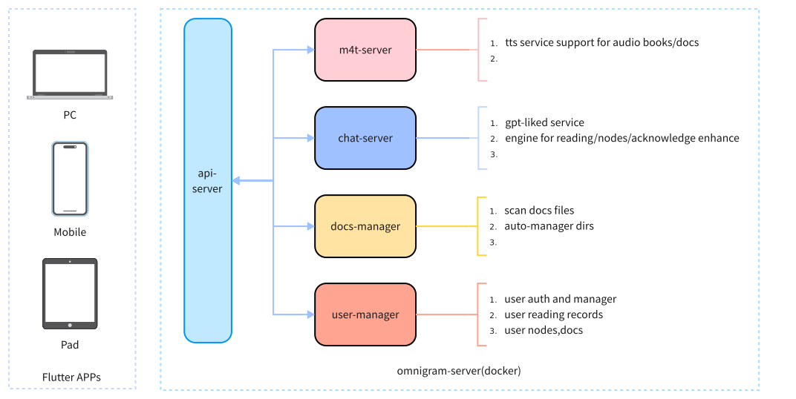

#

<picture>
  <source
    srcset="./docs/static/img/logo_with_letter_dark.svg"
    media="(prefers-color-scheme: dark)"
  />
  <source
    srcset="./docs/static/img/logo_with_letter_white.svg"
    media="(prefers-color-scheme: light), (prefers-color-scheme: no-preference)"
  />
  
</picture>

<div style="font-size: 1.5rem;">
  <a href="./README.md">English</a> | <a href="./README.zh.md">中文</a>
</div>
</br>

 
 


## About Omnigram

> **Jellyfin for videos. Immich for photos. Omnigram for books.**

Omnigram is an **AI-native, self-hosted book library management and reading service**. Deploy it on your NAS or homeserver with Docker, and turn your ebook collection into an intelligent, searchable, listenable personal library.

Built with a Go backend and Flutter multi-platform client, Omnigram combines book management, AI-powered reading assistance, and TTS audiobook generation into a single, self-hosted solution — something no existing tool provides.

### Why Omnigram?

- 📚 **Calibre-Web** manages books but has no AI, no TTS, and an aging UI
- 🎧 **Audiobookshelf** plays existing audiobooks but can't generate them from ebooks
- 📖 **Anx Reader** is a great reader app but has no server — single-device only
- 💸 **Readwise Reader** is powerful but costs $8.99/mo and isn't self-hostable

**Omnigram fills the gap: self-hosted + AI + reading — all in one.**

## Features

### Available Now
- [x] Multi-format ebook reading (EPUB, PDF)
- [x] iOS & Android native client
- [x] TTS text-to-speech with customizable engines (Fish Audio)
- [x] AI conversational assistant for reading
- [x] Self-hosted book library with NAS storage support
- [x] Book search, notes, bookmarks, favorites, downloads
- [x] Multi-user management with OPDS protocol
- [x] Docker one-click deployment

### Roadmap
- [ ] AI book summarization & chapter insights
- [ ] Semantic search across entire library
- [ ] AI-powered cross-book knowledge linking
- [ ] High-quality multi-voice TTS audiobook generation
- [ ] AI translation with bilingual side-by-side reading
- [ ] WebDAV protocol support
- [ ] Web reader interface
- [ ] Windows, Linux, Mac desktop clients

## Omnigram Infrastructure



## Official Documentation

You can find the official documentation (including installation manuals) at <https://omnigram.lxpio.com/>.

## Examples

For the mobile app, you can use https://omnigram-demo.lxpio.com:9443 for the Server Endpoint URL

```
The credential
email: admin
password: 123456
```


## For Dev

This project uses a three-way repository including:

- [riverpod](https://docs-v2.riverpod.dev/docs)
- [isar](https://isar.dev)

### Build

#### For Omnigram APP 

```bash

git clone github.com/lxpio/omnigram.git
cd omnigram/app
make
```

#### For Omnigram Server

```bash

git clone github.com/lxpio/omnigram.git
cd omnigram/server
make 

# make docker 
```


### TTS Service

When the current App supports the FishTTS API Server, refer to [FishTTS](https://github.com/fishaudio/fish-speech).

```bash
git clone https://github.com/fishaudio/fish-speech.git
cd fish-speech

pip install -e .
python -m tools.api_server --listen 0.0.0.0:8999 --llama-checkpoint-path "checkpoints/fish-speech-1.5" --decoder-checkpoint-path "checkpoints/fish-speech-1.5/firefly-gan-vq-fsq-8x1024-21hz-generator.pth"
```

## Tech Stack

| Component | Technology |
|-----------|-----------|
| **Server** | Go 1.23 + Gin + GORM |
| **Client** | Flutter 3.24 + Riverpod |
| **TTS** | Fish Audio (gRPC) |
| **Database** | SQLite/PostgreSQL + BadgerDB |
| **Deployment** | Docker / Docker Compose |

## Acknowledgments

This project makes extensive use of code from [Immich](https://github.com/immich-app/immich), and we thank them for their open-source contributions.

Key libraries and dependencies:

- [riverpod](https://docs-v2.riverpod.dev/docs) — State management
- [isar](https://isar.dev) — Local database
- [fish-speech](https://github.com/fishaudio/fish-speech) — TTS engine

## License

This project is licensed under the MIT License - see the [LICENSE.md](LICENSE.md) file for details