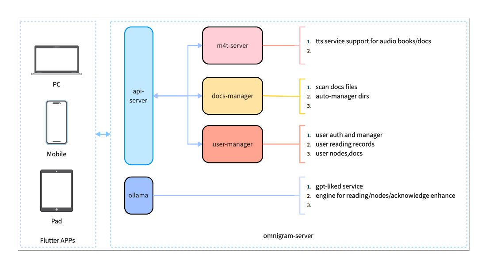

#

<picture>
  <source
    srcset="./docs/static/img/logo_with_letter_dark.svg"
    media="(prefers-color-scheme: dark)"
  />
  <source
    srcset="./docs/static/img/logo_with_letter_white.svg"
    media="(prefers-color-scheme: light), (prefers-color-scheme: no-preference)"
  />
  
</picture>

<div style="font-size: 1.5rem;">
  <a href="./README.md">English</a> | <a href="./README.zh.md">中文</a>
</div>
</br>

 
 


## 关于

Omnigram 是 Flutter 编写的支持多平台（iOS、Android、Web、Windows、Linux、Mac）文件阅读和听书客户端，它支持多种格式，包括 EPUB 和 PDF。它通过 TTS 模型提供听书功能，支持其他 AI 模型进行辅助阅读。此外，它还具备本地书籍管理功能，允许用户轻松管理书籍在 NAS 上的存储。其后端服务部署参阅 [omnigam-server](server/README.zh.md)。或者参考[项目官方文档](https://omnigram.lxpio.com)

## 特性

- [x] 支持 iOS、Android 端 EPUB 电子书阅读
- [x] 支持 TTS 语音朗读，支持自定义 TTS 引擎。
- [x] 支持本地书籍管理(NAS)，支持书籍搜索、阅读、听书、笔记、收藏、下载、删除、设置等
- [x] 支持对话助手，支持 Markdown 语法，支持代码块高亮，支持对话设置。
- [x] 电子书支持使用模型进行 TTS 阅读
- [ ] 支持 PDF、文档等 NAS 内容服务管理。
- [ ] 支持 Web、Windows、Linux、Mac。

## 基本构架



## 官方文档

您可以在 <https://omnigram.lxpio.com/zh> 找到官方文档（包含安装手册）。

## 示例

对于APP 后端，你可以使用实例地址： https://omnigram-demo.lxpio.com:9443 。由于

```
凭证信息：
用户名：admin
密码： 123456
```
> 服务器信息：腾讯轻量服务器（ 2cpu - 2GB RAM - 3Mbps）

 

## 二次开发


### 编译

#### App 编译

```bash

git clone github.com/lxpio/omnigram.git
cd omnigram/app
make
```

#### Omnigram Server 编译

```bash

git clone github.com/lxpio/omnigram.git
cd omnigram/server
make 

# make docker 
```

#### 语音服务

当当前App支持FishTTS API Server，参考 [FishTTS](https://github.com/fishaudio/fish-speech)。

```bash

git clone https://github.com/fishaudio/fish-speech.git
cd fish-speech

pip install -e .
python -m tools.api_server --listen 0.0.0.0:8999 --llama-checkpoint-path "checkpoints/fish-speech-1.5"     --decoder-checkpoint-path "checkpoints/fish-speech-1.5/firefly-gan-vq-fsq-8x1024-21hz-generator.pth"

```


## 感谢

本项目使用了大量 [Immich](https://github.com/immich-app/immich) 的代码，感谢其开源精神。

本项目创建过程使用三分库包括：

- [riverpod](https://docs-v2.riverpod.dev/docs)
- [isar](https://isar.dev)
- [fish-speech](https://github.com/fishaudio/fish-speech)


