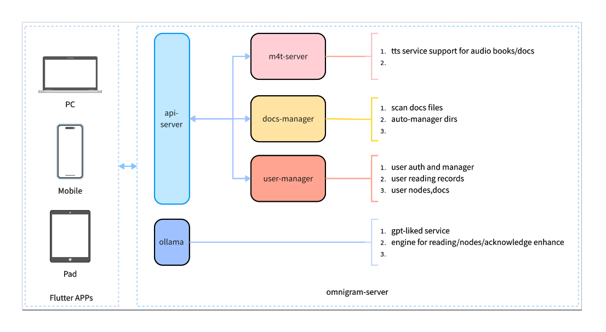

#

<picture>
  <source
    srcset="./assets/img/logo_with_letter_dark.svg"
    media="(prefers-color-scheme: dark)"
  />
  <source
    srcset="./assets/img/logo_with_letter_white.svg"
    media="(prefers-color-scheme: light), (prefers-color-scheme: no-preference)"
  />
  
</picture>

<div style="font-size: 1.5rem;">
  <a href="./README.md">English</a> | <a href="./README.zh.md">中文</a>
</div>
</br>

 


## 关于

> **Jellyfin 管视频，Immich 管照片，Omnigram 管书籍。**

Omnigram 是一个 **AI 原生的自托管书库管理与阅读服务**。通过 Docker 一键部署到你的 NAS 或家庭服务器，将电子书收藏变成一个智能的、可搜索的、可收听的个人图书馆。

基于 Go 后端 + Flutter 多平台客户端构建，Omnigram 将书库管理、AI 辅助阅读、TTS 有声书生成融为一体 —— 这是目前市面上没有任何工具能提供的。

### 为什么选 Omnigram？

- 📚 **Calibre-Web** 能管书，但没有 AI、没有 TTS、界面老旧
- 🎧 **Audiobookshelf** 能播有声书，但不能从电子书生成有声书
- 📖 **Anx Reader** 阅读体验好，但没有服务端 —— 只能单设备使用
- 💸 **Readwise Reader** 功能强大，但月费 $8.99 且不支持自托管

**Omnigram 填补了这个空白：自托管 + AI + 阅读 —— 一站式解决。**

## 特性

### 已实现（App — 基于 Anx Reader）
- [x] 多格式电子书阅读（EPUB、MOBI、AZW3、FB2、TXT、PDF）
- [x] iOS、Android、macOS、Windows 原生客户端
- [x] AI 对话助手（本地 LLM 集成）
- [x] TTS 语音朗读，支持多种音色
- [x] 阅读笔记、高亮、书签
- [x] AI 思维导图生成
- [x] 全书翻译 + 双语对照阅读
- [x] 阅读统计热力图
- [x] WebDAV 同步（客户端）

### 已实现（Server）
- [x] 自托管书库，目录扫描
- [x] 多格式元数据提取（EPUB）
- [x] 多用户管理，会话认证
- [x] 书籍搜索、收藏、阅读进度同步
- [x] Docker 一键部署（SQLite/PostgreSQL/MySQL）
- [x] 服务端 TTS（Sidecar 方案：Kokoro / Edge TTS，OpenAI 兼容 API）

### 规划中
- [ ] 🔒 Server 安全加固（进行中）
- [ ] 📚 书籍元数据编辑管理 API
- [ ] 🌐 **Web UI** — 精美的书库浏览界面，支持暗色模式
- [ ] 📂 WebDAV 服务端（同步 Anx Reader / KOReader）
- [ ] 📖 OPDS 目录协议
- [ ] 🏷️ 标签、书架、书库组织
- [ ] 📝 笔记 & 高亮跨设备同步
- [ ] 🤖 AI 导入时自动补全元数据（LLM/Ollama）
- [ ] 🔍 全书库语义搜索
- [ ] 📊 AI 书籍摘要与章节洞察
- [ ] 🧠 AI 跨书知识关联
- [ ] 🎧 高质量多角色 TTS 有声书生成（服务端）
- [ ] 📖 Web 阅读器（foliate-js 浏览器内阅读）
- [ ] 📥 Calibre 数据库导入工具
- [ ] 🐧 Linux 桌面客户端

## 基本构架



## 官方文档

您可以在 <https://omnigram.lxpio.com/zh> 找到官方文档（包含安装手册）。

## 示例

对于APP 后端，你可以使用实例地址： https://omnigram-demo.lxpio.com:9443 。由于

```
凭证信息：
用户名：admin
密码： 123456
```

## 二次开发

### 编译

#### App 编译（Flutter）

```bash
git clone https://github.com/lxpio/omnigram.git
cd omnigram/app
flutter pub get
flutter pub run build_runner build
flutter build apk  # 或: flutter build ios / macos / windows
```

#### Omnigram Server 编译（Go）

```bash
git clone https://github.com/lxpio/omnigram.git
cd omnigram/server
make

# Docker 构建
make docker
```

#### 语音服务

Omnigram Server 通过 Sidecar Docker 容器提供 TTS 服务，使用 OpenAI 兼容 API。默认推荐 [Kokoro-FastAPI](https://github.com/remsky/Kokoro-FastAPI)：

```yaml
# docker-compose.yml — 添加 TTS Sidecar
services:
  tts:
    image: ghcr.io/remsky/kokoro-fastapi:latest
    # OpenAI 兼容 API: POST /v1/audio/speech
    # 默认 CPU 模式，添加 GPU 资源可加速
```

配置 `TTS_PROVIDER=kokoro` 和 `TTS_SIDECAR_URL=http://tts:8880`。

Edge TTS 也可作为零部署 fallback（无需额外容器）。

## 技术栈

| 组件 | 技术 |
|------|------|
| **服务端** | Go 1.23 + Gin + GORM + BadgerDB |
| **客户端** | Flutter 3.41 + Riverpod（基于 Anx Reader） |
| **语音合成** | Kokoro / Edge TTS (OpenAI 兼容 Sidecar) / langchain_dart (客户端) |
| **数据库** | SQLite / PostgreSQL / MySQL |
| **部署** | Docker / Docker Compose |

## 感谢

Omnigram 的客户端基于 [Anx Reader](https://github.com/Anxcye/anx-reader)（MIT 许可证）。感谢其在阅读体验方面的卓越工作。

核心依赖库：

- [Anx Reader](https://github.com/Anxcye/anx-reader) — 客户端基础
- [foliate-js](https://github.com/nickthecook/foliate-js) — 电子书渲染引擎
- [riverpod](https://riverpod.dev/) — 状态管理
- [langchain_dart](https://github.com/davidmigloz/langchain_dart) — AI 集成
- [Kokoro-FastAPI](https://github.com/remsky/Kokoro-FastAPI) — TTS 引擎（Sidecar）


