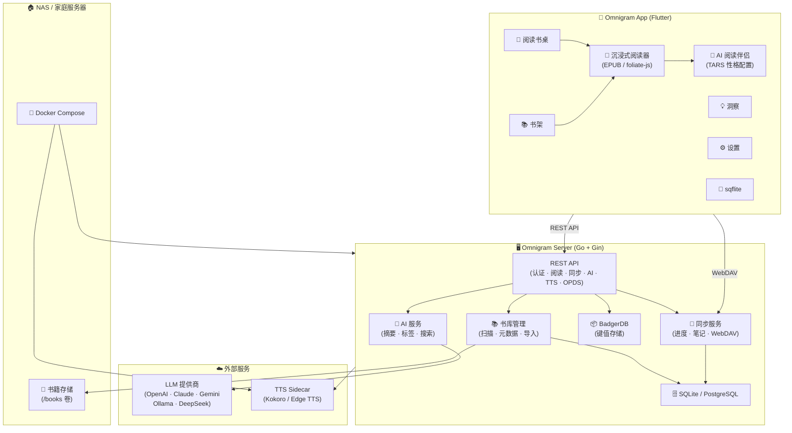

#

<picture>
  <source
    srcset="./assets/img/logo_with_letter_dark.svg"
    media="(prefers-color-scheme: dark)"
  />
  <source
    srcset="./assets/img/logo_with_letter_white.svg"
    media="(prefers-color-scheme: light), (prefers-color-scheme: no-preference)"
  />
  
</picture>

<div style="font-size: 1.5rem;">
  <a href="./README.md">English</a> | <a href="./README.zh.md">中文</a>
</div>
</br>


## 关于 Omnigram

> **Jellyfin 管视频，Immich 管照片，Omnigram 管书籍。**

Omnigram 是一个 **AI 原生的自部署书库管理和阅读服务**。部署在你的 NAS 或 homeserver 上，你的电子书不再是一堆文件，而是一个有智能、有记忆、有温度的个人图书馆。

### 起源

我是一个技术控，NAS 里存了大量的 PDF、EPUB。时间一长，文件混乱，搜索费劲，读过的书在记忆中变得模糊。市面上没有一款工具能同时解决"管理"和"AI 增强阅读"的问题——于是 Omnigram 诞生了。

### 市场空白

```
                    有服务端(NAS/自部署)          无服务端(纯客户端)
                 ┌──────────────────────┬──────────────────────┐
   有AI能力      │                      │  Anx Reader          │
                 │    ❌ 空白！          │  Readwise (SaaS)     │
                 │                      │                      │
                 ├──────────────────────┼──────────────────────┤
   无AI能力      │  Calibre-Web         │  KOReader            │
                 │  Kavita              │  Foliate             │
                 │  Audiobookshelf      │                      │
                 └──────────────────────┴──────────────────────┘
```

**"自部署 + AI + 阅读"这个象限 = 零竞争。这就是 Omnigram 的位置。**

---

## 设计哲学

### AI 是空气，不是按钮

这是 Omnigram 和所有竞品最本质的区别。

大多数"AI 阅读器"的做法是在阅读器旁边塞一个 ChatGPT 对话框。这不是 AI 阅读，这是阅读 + 聊天。

Omnigram 的 AI 是**隐形的**：
- 翻到新章节，页面上方淡入一行"前情提要"——你没有点任何按钮
- 选中一个词，浮窗里自然出现释义——你没有"打开 AI"
- 你的书架按主题自动分组，导入的书自动有了标签和摘要
- 你的笔记不是散落的高亮，而是按概念聚合的知识网络

**用户不是在"用 AI"，用户是在读书——只是这个读书体验本身变了。**

### 阅读伴侣，不是阅读工具

阅读一直是孤独的。AI 可以改变这一点。

Omnigram 的 AI 是一个可配置性格的阅读伴侣——像《星际穿越》里的 TARS，你可以调节它的主动性、风格、深度和温度。它可以是安静的书童，也可以是苏格拉底式的导师，也可以是和你一起读书的朋友。

### 洞察而非统计

传统阅读 app 给你柱状图和热力图——"你这个月读了 300 页"。所以呢？

Omnigram 的洞察页用 AI 讲述你的阅读旅程：你这个月深入了什么领域，哪些书之间有知识关联，你的阅读正在走向什么方向。不是给你数据，而是给你**自我认知**。

### 隐私即自由

有些书不方便被别人知道。Omnigram 有一个完全隔离的"隐身书房"——主界面零痕迹，生物识别进入，里面有完整的阅读体验和 AI 功能。隐私保护的是别人的视线，不是你自己的阅读体验。

---

## 特性

### 阅读体验
- 多格式电子书阅读（EPUB、MOBI、AZW3、FB2、TXT）
- iOS、Android、macOS、Windows 原生客户端
- 四 Tab 导航：**阅读书桌** | **书架** | **洞察** | **设置**
- 阅读书桌——打开 app 就像坐到书桌前，一键继续阅读
- 全屏沉浸式阅读器，可自定义排版
- 阅读笔记、高亮、书签
- TTS 语音朗读，多种音色

### AI 驱动（隐形集成）
- AI 阅读伴侣，性格可配置（TARS 模式——调节主动性、风格、深度、温度）
- 上下文条——翻页时自动淡入章节回顾
- 内联释义——选词即出释义，不离开正文
- 页边批注——AI 自动发现跨书知识关联
- 智能书架——导入时自动打标签、生成摘要、估算阅读时长
- 语义搜索——用意思搜索，不只是关键词
- 知识网络——笔记按概念跨书聚合
- 阅读叙事——AI 讲述你的阅读旅程，不是给你图表

### 服务端
- 自部署书库，目录扫描
- 多格式元数据提取
- 多用户管理，会话认证
- 书籍搜索、收藏、阅读进度跨设备同步
- Docker 一键部署（SQLite / PostgreSQL / MySQL）
- 服务端 TTS（Kokoro / Edge TTS，OpenAI 兼容 API）
- OPDS 目录协议

### 隐私
- 隐身书房——完全隔离的第二空间，生物识别进入
- 主界面零痕迹——隐身书籍不出现在书架、搜索、洞察的任何地方
- 隐身空间内有完整的 AI 体验
- 本地加密存储，平台密钥管理

### 数据可移植
- 笔记/高亮导出为 Markdown、JSON 或 CSV
- 知识网络导出至 Obsidian / Logseq
- 从 Kindle、Apple Books、Readwise 导入高亮
- 完整书库导出为可移植存档
- OPDS 目录互操作

---

## 一个类比

如果 Calibre-Web 是图书馆的书架——你来找书，自己读——那 Omnigram 就是给你配了一个私人图书馆管理员。

他记得你读过什么、喜欢什么、上次读到哪里。偶尔会说"这本你可能感兴趣，它和你上个月读的那本有关联"。他不话多，但你需要他的时候，他什么都知道。

---

## 基本架构


```mermaid
graph TB
    subgraph Client["📱 Omnigram App (Flutter)"]
        Desk["📖 阅读书桌"]
        Library["📚 书架"]
        Insights["💡 洞察"]
        Settings["⚙ 设置"]
        Reader["📄 沉浸式阅读器<br/>(EPUB / foliate-js)"]
        Companion["🤖 AI 阅读伴侣<br/>(TARS 性格配置)"]
        LocalDB["💾 sqflite"]
    end

    subgraph Server["🖥️ Omnigram Server (Go + Gin)"]
        API["REST API<br/>(认证 · 阅读 · 同步 · AI · TTS · OPDS)"]
        BookMgr["📚 书库管理<br/>(扫描 · 元数据 · 导入)"]
        AIService["🧠 AI 服务<br/>(摘要 · 标签 · 搜索)"]
        SyncService["🔄 同步服务<br/>(进度 · 笔记 · WebDAV)"]
        DB["🗄️ SQLite / PostgreSQL"]
        Store["📦 BadgerDB<br/>(键值存储)"]
    end

    subgraph External["☁️ 外部服务"]
        LLM["LLM 提供商<br/>(OpenAI · Claude · Gemini<br/>Ollama · DeepSeek)"]
        TTS["TTS Sidecar<br/>(Kokoro / Edge TTS)"]
    end

    subgraph NAS["🏠 NAS / 家庭服务器"]
        Docker["🐳 Docker Compose"]
        Storage["📁 书籍存储<br/>(/books 卷)"]
    end

    Desk --> Reader
    Library --> Reader
    Reader --> Companion
    Client -->|REST API| API
    Client -->|WebDAV| SyncService

    API --> BookMgr
    API --> AIService
    API --> SyncService
    BookMgr --> DB
    BookMgr --> Storage
    AIService --> LLM
    SyncService --> DB
    API --> Store

    Docker --> Server
    Docker --> TTS
    Server --> TTS
```

## 官方文档

您可以在 <https://omnigram.lxpio.com/zh> 找到官方文档（包含安装手册）。

## 示例

对于 App 后端，你可以使用实例地址：https://omnigram-demo.lxpio.com:9443

```
凭证信息：
用户名：admin
密码：123456
```

## 二次开发

### 编译

#### App 编译（Flutter）

```bash
git clone https://github.com/lxpio/omnigram.git
cd omnigram/app
flutter pub get
flutter gen-l10n
dart run build_runner build --delete-conflicting-outputs
flutter build apk  # 或: flutter build ios / macos / windows
```

#### Server 编译（Go）

```bash
git clone https://github.com/lxpio/omnigram.git
cd omnigram/server
make

# Docker 构建
make docker
```

### 语音服务

Omnigram Server 通过 Sidecar Docker 容器提供 TTS 服务，使用 OpenAI 兼容 API。默认推荐 [Kokoro-FastAPI](https://github.com/remsky/Kokoro-FastAPI)：

```yaml
# docker-compose.yml — 添加 TTS Sidecar
services:
  tts:
    image: ghcr.io/remsky/kokoro-fastapi:latest
    # OpenAI 兼容 API: POST /v1/audio/speech
    # 默认 CPU 模式，添加 GPU 资源可加速
```

配置 `TTS_PROVIDER=kokoro` 和 `TTS_SIDECAR_URL=http://tts:8880`。

Edge TTS 也可作为零部署 fallback（无需额外容器）。

## 技术栈

| 组件 | 技术 |
|------|------|
| **服务端** | Go 1.23 + Gin + GORM + BadgerDB |
| **客户端** | Flutter 3.41 + Riverpod v2 |
| **AI** | langchain_dart（OpenAI, Claude, Gemini, Ollama, DeepSeek） |
| **语音合成** | Kokoro / Edge TTS（服务端 Sidecar）+ sherpa-onnx（设备端） |
| **数据库** | SQLite / PostgreSQL / MySQL |
| **部署** | Docker / Docker Compose |

## 感谢

Omnigram 的阅读引擎构建于 [Anx Reader](https://github.com/Anxcye/anx-reader)（MIT 许可证）。感谢其卓越的工作。

核心依赖库：

- [Anx Reader](https://github.com/Anxcye/anx-reader) — 阅读引擎基础
- [foliate-js](https://github.com/nickthecook/foliate-js) — 电子书渲染引擎
- [Riverpod](https://riverpod.dev/) — 状态管理
- [langchain_dart](https://github.com/davidmigloz/langchain_dart) — AI 集成
- [Kokoro-FastAPI](https://github.com/remsky/Kokoro-FastAPI) — TTS 引擎（Sidecar）

## 许可证

本项目采用 MIT 许可证 - 详见 [LICENSE.md](LICENSE.md)
