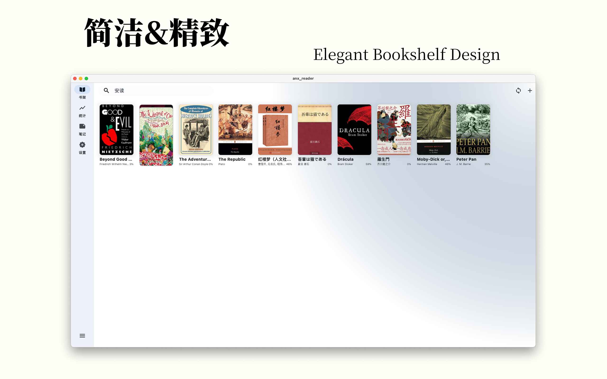
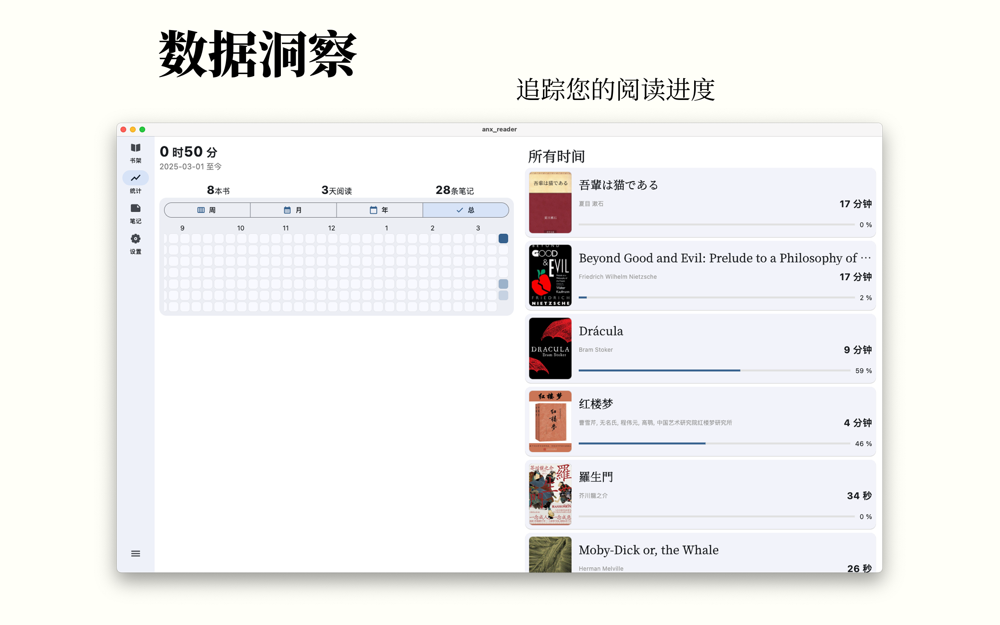
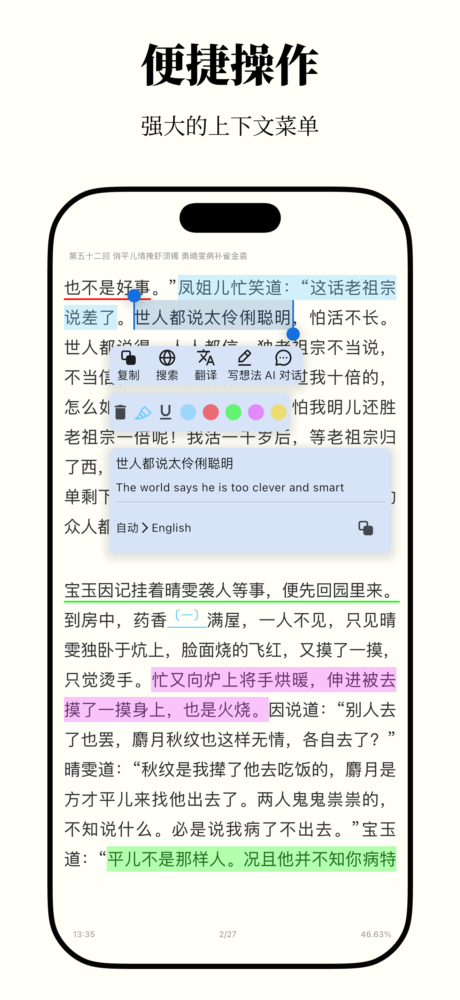

[English](README.md) | **简体中文** | [Türkçe](README_tr.md)

  

<h1 align="center">Omnigram - 让阅读更专注</h1>

<em>基于 <a href="https://github.com/Anxcye/anx-reader">Anx Reader</a> (MIT Licensed)</em>

Omnigram，一款为热爱阅读的你精心打造的电子书阅读器。集成多种 AI 能力，支持丰富的电子书格式，让阅读更智能、更专注。现代化界面设计，只为提供纯粹的阅读体验。

| 功能模块 | 详细说明 | 状态 |
| --- | --- | --- |
| 多种格式 | EPUB/MOBI/AZW3/FB2/TXT/PDF 已支持 | ✅ |
| 全平台数据同步 | Android/iOS/macOS/Windows 多端覆盖 书籍文件、笔记、阅读进度一站式同步 | ✅ |
| AI 助理 | 按阅读进度与风格整理书架 生成思维导图辅助理解 AI 词典与即时翻译 提供观点分析与内容总结 | ✅ |
| 自定义阅读体验 | 调整字间距、段间距、行间距与边距 自定义字体大小、样式与字重 配置阅读配色、背景图片 设置对齐方式与自定义样式 | ✅ |
| 记录笔记 | 多配色与样式选择 按时间、章节排序并可按颜色筛选 导出 TXT/Markdown/CSV 等多种格式 一键生成美观卡片便于分享 | ✅ |
| 阅读统计 | 记录阅读时长 按年/月/周/日维度查看 阅读热力图呈现习惯变化 | ✅ |
| 其他 | 听书功能：支持多模型、语速、音色与定时 书籍全文翻译：原文、译文对照阅读 节省空间：云端上传节省本地存储，随用随下 简繁转换：中文简繁体一键转换 | ✅ |
| OPDS 书源 | 支持 OPDS 书源，支持自定义添加  |  🛠️  |

<table border="1">
  <tr>
    <th>OS</th>
    <th>Source</th>
  </tr>
  <tr>
    <td>iOS</td>
    <td>
      
    </td>
  </tr>
  <tr>
    <td>macOS</td>
    <td>
      
      
    </td>
  </tr>
  <tr>
    <td>Windows</td>
    <td>
      
    </td>
  </tr>
  <tr>
    <td>Android</td>
    <td>
      
      
    </td>
  </tr>
</table>

### 我遇到了问题，怎么办？
查看[故障排除](./docs/troubleshooting.md#简体中文)

提出一个[issue](https://github.com/Anxcye/anx-reader/issues/new/choose)，将会尽快回复。

Telegram 群组：[https://t.me/AnxReader](https://t.me/AnxReader)

QQ群：1042905699

### 截图
|  |  |
| :--------------------------: | :--------------------------: |
|  |  |
|  |  |
|  |  |

|  |  |  |
| :----------------------------: | :----------------------------: | :----------------------------: |
|  |  |  |
|  |  |  |

## 捐赠
如果你喜欢安读，请考虑捐赠支持项目。您的支持将帮助我优化功能、修复问题，并为您带来更好的阅读体验！感谢您的慷慨支持！

❤️ [捐赠](https://anxcye.com/home/7)

## 构建
希望从源码构建安读？请参考以下步骤：
- 安装 [Flutter](https://flutter.dev)。
- 克隆并进入项目目录。
- 运行 `flutter pub get` 。
- 运行 `flutter gen-l10n` 生成多语言文件。
- 运行 `dart run build_runner build --delete-conflicting-outputs` 生成 Riverpod 代码。
- 运行 `flutter run` 启动应用。

您可能遇到 Flutter 版本不兼容的问题，请参考 [Flutter 文档](https://flutter.dev/docs/get-started/install)。
